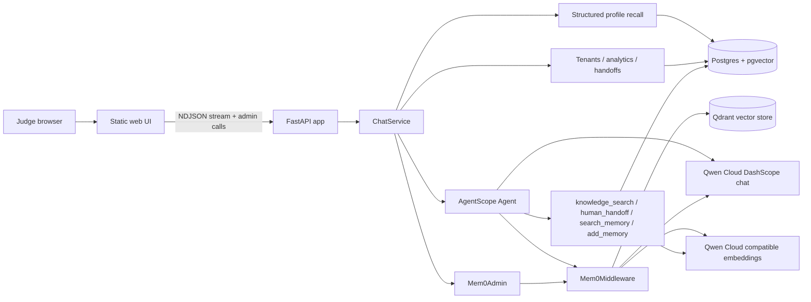

# DOSClaw-Qwen Architecture

DOSClaw-Qwen is a standalone AgentScope 2.0 customer-support agent for the Qwen Cloud MemoryAgent track.

## Runtime Flow

## Memory Model

- `Mem0Middleware` owns episodic long-term memory, scoped with `user_id=customer_id` and `agent_id=tenant_id`.
- Mem0 normally runs in `both` mode: automatic recall/write-back plus agent-controlled `search_memory` and `add_memory` tools.
- If a customer pauses memory consent, the app switches that chat turn to AgentScope `agent_control` mode and skips automatic structured profile writes.
- `Mem0Admin` exposes scoped list, get, search, add, update, delete, delete-all, and history operations for the judge-facing controls.
- Qdrant stores mem0 episodic vectors in the deployed runtime. Local development can use either the Qdrant compose service or the local-path fallback.
- Postgres owns durable structured profile facts, tenant customers, FAQ knowledge vectors, and handoff tickets.
- The UI receives a `memory` event before answer streaming so judges can see which profile and mem0 memories were recalled.
- The UI includes Memory controls, profile/consent controls, tenant switching, support analytics, a staff handoff dashboard, and a Knowledge base panel so judges can inspect the underlying product surfaces directly.
- The UI also renders runtime and tool metadata below assistant replies so judges can see the Qwen model, Mem0/Qdrant backend, and tool calls.
- `MemoryService.record` extracts durable profile facts from each completed turn with Qwen JSON output and merges conflicts by letting newer facts win.
- Embeddings use a small AgentScope `EmbeddingModelBase` adapter over DashScope's OpenAI-compatible endpoint. AgentScope's native `DashScopeEmbeddingModel` currently calls the native DashScope SDK path and does not honor the international compatible `base_url`, so the adapter keeps chat, FAQ vectors, and mem0 on the same Qwen Cloud key.

## Data Isolation

- Customer isolation: `customer_id` maps to mem0 `user_id`.
- Tenant isolation: `tenant_id` maps to mem0 `agent_id` and filters Postgres tables.
- The demo ships with two tenants, `tenant_demo` and `tenant_skate`, each with its own customers, profile facts, and FAQ rows.

## Deployment

The simplest Alibaba deployment is one ECS host running:

- `pgvector/pgvector:pg16` for Postgres.
- `qdrant/qdrant` for mem0 episodic memory.
- The Python app container from `Dockerfile`.
- Environment variables from a server-side `.env`, never committed.

Qwen Cloud usage is proven in `dosclaw_qwen/model.py`, which constructs AgentScope DashScope chat and embedding models.
