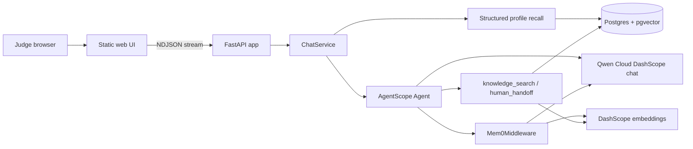

# DOSClaw-Qwen Architecture

DOSClaw-Qwen is a standalone AgentScope 2.0 customer-support agent for the Qwen Cloud MemoryAgent track.

## Runtime Flow

## Memory Model

- `Mem0Middleware` owns episodic long-term memory, scoped with `user_id=customer_id` and `agent_id=tenant_id`.
- Postgres owns durable structured profile facts, tenant customers, FAQ knowledge vectors, and handoff tickets.
- The UI receives a `memory` event before answer streaming so judges can see which profile and mem0 memories were recalled.
- `MemoryService.record` extracts durable profile facts from each completed turn with Qwen JSON output and merges conflicts by letting newer facts win.

## Data Isolation

- Customer isolation: `customer_id` maps to mem0 `user_id`.
- Tenant isolation: `tenant_id` maps to mem0 `agent_id` and filters Postgres tables.
- The demo ships with one tenant, `tenant_demo`, and two customers.

## Deployment

The simplest Alibaba deployment is one ECS host running:

- `pgvector/pgvector:pg16` for Postgres.
- The Python app container from `Dockerfile`.
- Environment variables from a server-side `.env`, never committed.

Qwen Cloud usage is proven in `dosclaw_qwen/model.py`, which constructs AgentScope DashScope chat and embedding models.
