# DOSClaw-Qwen - an SME support agent that actually remembers its customers

DOSClaw-Qwen is a customer-support agent for small businesses, built for the **Global AI
Hackathon Series with Qwen Cloud** (**MemoryAgent track**). Its differentiator is a real
**per-customer persistent memory** engine: DOSClaw-Qwen remembers each customer across sessions, recalls
the right facts in a limited context window, and keeps stale details out of the active context - so returning customers are
never asked the same thing twice.

Built on **AgentScope 2.0** (Alibaba's open-source agent framework) and **Qwen Cloud / DashScope**
(`qwen3.6-plus` for reasoning, `text-embedding-v4` for semantic memory), deployed on **Alibaba Cloud**.

## Why it fits MemoryAgent

The track rewards autonomous experience accumulation, efficient storage/retrieval, timely
forgetting, and recalling critical memories within a limited context window. DOSClaw-Qwen implements all
four with AgentScope 2.0's mem0-backed middleware plus a custom structured profile layer:

- **Profile (structured, durable):** stable facts per tenant/customer (name, preferences, allergies, last
  order). Updated by an LLM extraction step after each turn; conflicting facts are overwritten.
- **Episodic (semantic):** handled by AgentScope's `Mem0Middleware`, scoped natively by
  `user_id=customer_id` and `agent_id=tenant_id`, with DashScope/Qwen used for memory extraction
  and embeddings.
- **Recall in a limited context:** before replying, DOSClaw-Qwen assembles a compact block = full profile
  + the mem0 memories retrieved by middleware - only that block enters the prompt, not the whole history.
- **Forgetting / consolidation:** stale context is avoided by scoped retrieval and compact profile
  consolidation, while durable facts persist in the profile.

## Architecture



```
Web chat UI (customer selector + new-session + memory and knowledge controls)
        |  HTTP / SSE
FastAPI  --  AgentScope Agent + Mem0Middleware (Qwen qwen3.6-plus via DashScope)
        |        |  tools: knowledge_search (FAQ RAG), human_handoff, search_memory, add_memory
        |   MemoryService  --  profile recall / consolidate
        |   Mem0Admin      --  list/search/add/update/delete/history
        |        |
   Postgres + pgvector  (tenants, profile, knowledge, handoffs)           [on Alibaba Cloud]
        |
   DashScope: qwen3.6-plus (chat) + text-embedding-v4 (embeddings)        [Qwen Cloud]
```

Everything runs on Alibaba Cloud (ECS + Dockerized Postgres, or RDS); Qwen Cloud provides the model
and embeddings. The proof-of-Alibaba code file is [`dosclaw_qwen/model.py`](dosclaw_qwen/model.py).

## Status

Core MVP is built and verified with live Qwen Cloud: memory math, AgentScope/DashScope wiring,
mem0-backed episodic memory, agent-controlled memory tools, structured profile memory, tenant
knowledge search, human handoff, FastAPI endpoints, and the web demo UI are in place. The public
Alibaba Cloud ECI deployment is live at `http://8.219.211.170/`; see
**[docs/deployment-proof.md](docs/deployment-proof.md)**
and **[infra/alibaba/README.md](infra/alibaba/README.md)**.

## Run locally

Prerequisites: Python 3.11+ (3.14 works), Docker, and a Qwen Cloud `DASHSCOPE_API_KEY`.

```bash
cp .env.example .env          # fill in DASHSCOPE_API_KEY
docker compose up -d db qdrant # Postgres + pgvector + Qdrant
python -m venv .venv && . .venv/Scripts/activate   # (Windows: .venv\Scripts\activate)
pip install -r requirements.txt
# apply schema + seed, then run the seed-embeddings script and the app (see docs/implementation-plan.md)
uvicorn dosclaw_qwen.app:app --port 8092
```

## Docs

- [HANDOFF.md](HANDOFF.md) - build brief (start here if you are implementing)
- [docs/AGENTSCOPE_API.md](docs/AGENTSCOPE_API.md) - verified AgentScope 2.0.1 API
- [docs/implementation-plan.md](docs/implementation-plan.md) - task-by-task TDD plan
- [docs/spec-design.md](docs/spec-design.md) - design rationale
- [docs/hackathon-reference.md](docs/hackathon-reference.md) - hackathon rules and deliverables
- [docs/devpost-submission-fields.md](docs/devpost-submission-fields.md) - paste-ready submission fields
- [docs/demo-script.md](docs/demo-script.md) - live demo script
- [docs/video-recording-packet.md](docs/video-recording-packet.md) - 3-minute video plan
- [docs/judging-packet.md](docs/judging-packet.md) - judge-facing test notes
- [docs/deployment-proof.md](docs/deployment-proof.md) - Alibaba proof and current deployment gate
- [docs/legacy/](docs/legacy/) - assets from a prior, abandoned Next.js attempt (reference only)

## License

MIT - see [LICENSE](LICENSE).
