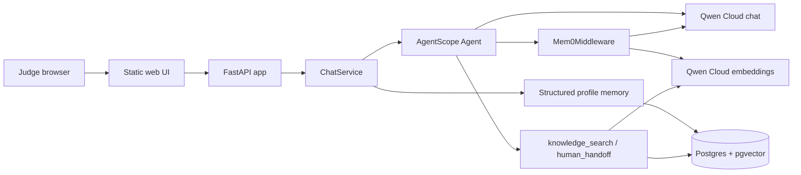

# Devpost Draft: DOSClaw-Qwen

## Title

DOSClaw-Qwen

## Tagline

A Qwen Cloud customer-support agent that remembers each customer across sessions.

## Track

MemoryAgent

## What It Does

DOSClaw-Qwen is a multilingual SME customer-support agent built around real per-customer persistent memory. The demo uses a cafe support scenario in English so judges can see cross-session recall clearly.

The agent remembers stable customer preferences, recalls the right facts before answering, keeps different customers isolated, answers policy questions through tenant-specific knowledge search, and escalates refund or complaint cases through a structured human handoff tool.

## Why It Fits MemoryAgent

The MemoryAgent track rewards agents that accumulate experience, retrieve the right memories inside a limited context window, and forget or avoid stale context. DOSClaw-Qwen implements that with:

- AgentScope 2.0 `Mem0Middleware` for episodic long-term memory.
- Native customer and tenant scoping: `user_id=customer_id`, `agent_id=tenant_id`.
- A structured Postgres profile layer for stable facts such as allergies, preferences, and last order.
- Qwen Cloud embeddings for FAQ search and memory storage.
- A visible memory side panel that shows what was recalled before each answer.

## How Qwen Cloud And Alibaba Cloud Are Used

Qwen Cloud powers both reasoning and embeddings:

- Chat model: `qwen3.6-plus` through DashScope.
- Embedding model: `text-embedding-v4` through DashScope's OpenAI-compatible endpoint.
- Proof code: `dosclaw_qwen/model.py`.

The live deployment runs on Alibaba Cloud Elastic Container Instance with a Python app container, a Postgres/pgvector sidecar, and an nginx public proxy sidecar. The repo includes managed-container scripts for ACR + Function Compute / Elastic Container Instance, the source-bootstrapped ECI path used for the live demo, and an ECS SSH deployment path for a known host.

## Architecture

## Demo Flow

1. Returning Customer A asks for a recommendation. DOSClaw-Qwen recalls lactose intolerance and oat milk preference.
2. Customer B starts a new session. Customer A's facts are not leaked.
3. A policy question triggers tenant knowledge search.
4. A refund complaint triggers human handoff and creates a ticket.

## Built With

- AgentScope 2.0
- Mem0Middleware from the AgentScope long-term-memory middleware work
- Qwen Cloud / DashScope
- FastAPI
- Postgres + pgvector
- Docker
- Alibaba Cloud ECI deployment scripts

## Links

- Source code: https://github.com/JOY/DOSClaw-Qwen
- Qwen Cloud model adapter: https://github.com/JOY/DOSClaw-Qwen/blob/main/dosclaw_qwen/model.py
- FastAPI demo surface: https://github.com/JOY/DOSClaw-Qwen/blob/main/dosclaw_qwen/app.py
- Architecture: https://github.com/JOY/DOSClaw-Qwen/blob/main/ARCHITECTURE.md
- Alibaba deployment docs: https://github.com/JOY/DOSClaw-Qwen/blob/main/infra/alibaba/README.md

## Submission Fields

- Live demo URL: http://8.219.211.170/
- Demo login: none required for the current public demo.
- Video URL: TODO after recording.
- Alibaba runtime proof: `scripts/deploy-eci-source.ps1` and `docs/deployment-proof.md`.
